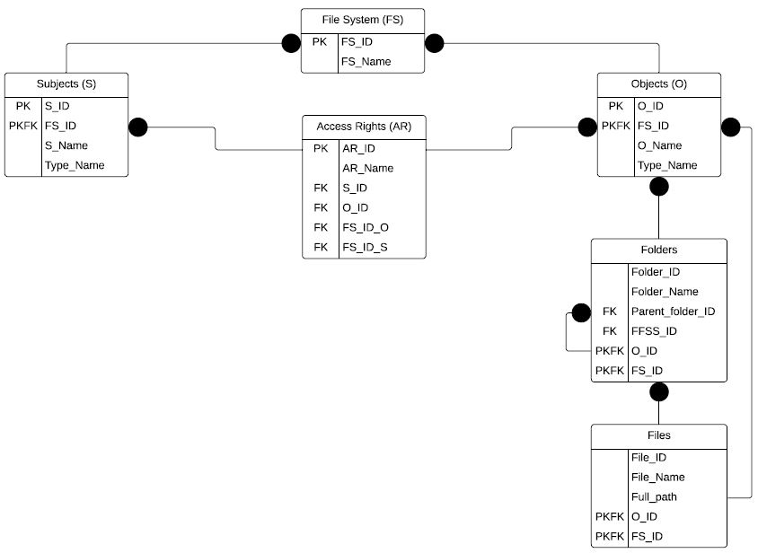

# Filesystem-database-SQL-Linter

The file system was chosen as the subject area, in which there are types of objects and access rights of subjects to objects. Data storage for access to confidential resources (taking into account the possible nesting of resources and access according to the model of a typed access matrix). In a typed access matrix, all objects are also subjects. Each object has a certain type, and each subject has some kind of access rights to objects.

Further, the following list of restrictions is introduced:

• The object can be a folder or a file;

• The file cannot but have a folder (there is always a root folder);

• The length of the name of files and folders must not exceed 32;

• Each object has some type.

The Create_DB_FileSystem_Linter.sql script creates a database and fills it with test data in accordance with the built relational data model of the developed file system.

The Queries_DB_FileSystem_Linter script performs typical SQL operations:

• UNION,

• INTERSECT,

• EXCEPT,

• CROSS JOIN,

• WHERE,

• SELECT,

• JOIN,

• LEFT JOIN,

• RIGHT JOIN,

• ORDER BY,

• COUNT,

• MIN,

• MAX,

• SUM,

• AVG.
